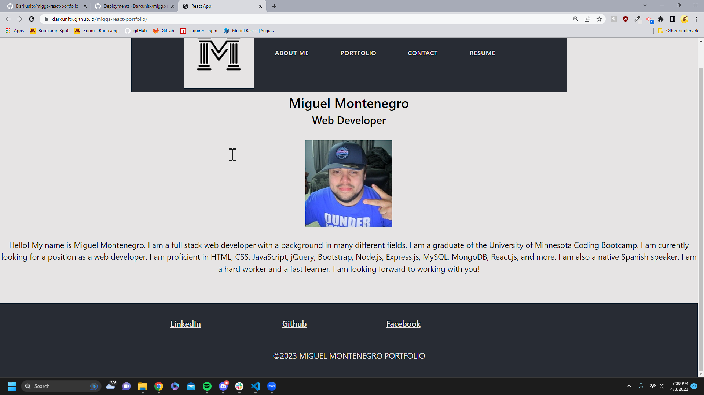

# My Portfolio

## Description 
- I have created this portfolio to help further my web developing skills and to show potential hiree seeking companies what i am truly capable of. This Portfolio will help companies understand me and it will make it easier for others to find my work and how to contact me.

## Table of contents
- [Description](#description)
- [Usage](#usage)
- [Credits](#credits)
- [License](#license)
- [Badges](#badges)

## Usage
- 
 This Website will allow users to find my contact info as well as additional links to my other sites 

- <a href="https://darkunitx.github.io/miggs-react-portfolio/">My Portfolio Live Website</a>
- <a href="https://github.com/Darkunitx/miggs-react-portfolio">My Portfolio Github Repo</a>

## Credits 

- In collaboration with : 
- Miguel Montenegro  https://github.com/Darkunitx
- Nicholas Mamberger https://github.com/NickHM05

## License

- MIT License

- Copyright (c) [2022] [Miguel Montenegro Portfolio]

- Permission is hereby granted, free of charge, to any person obtaining a copy of this software and associated documentation files (the "Software"), to deal in the Software without restriction, including without limitation the rights to use, copy, modify, merge, publish, distribute, sublicense, and/or sell copies of the Software, and to permit persons to whom the Software is furnished to do so, subject to the following conditions:

- The above copyright notice and this permission notice shall be included in all copies or substantial portions of the Software.

- THE SOFTWARE IS PROVIDED "AS IS", WITHOUT WARRANTY OF ANY KIND, EXPRESS OR IMPLIED, INCLUDING BUT NOT LIMITED TO THE WARRANTIES OF MERCHANTABILITY, FITNESS FOR A PARTICULAR PURPOSE AND NONINFRINGEMENT. IN NO EVENT SHALL THE AUTHORS OR COPYRIGHT HOLDERS BE LIABLE FOR ANY CLAIM, DAMAGES OR OTHER LIABILITY, WHETHER IN AN ACTION OF CONTRACT, TORT OR OTHERWISE, ARISING FROM, OUT OF OR IN CONNECTION WITH THE SOFTWARE OR THE USE OR OTHER DEALINGS IN THE SOFTWARE.

## Badges

